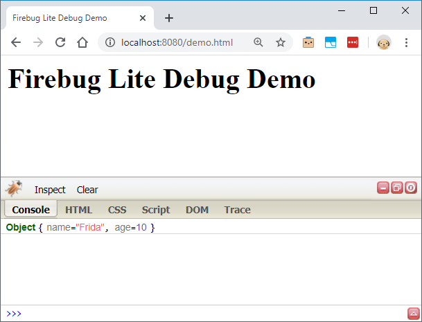

# Firebug Lite Debugger

An **unofficial** fork of the original firebug lite debugger console:



## Problem

Firebug has deprecated their debugger so when `firebug-lite-debug.js` is included, it tries to load resources from the following address:

https://getfirebug.com/releases/lite/latest/skin/xp/sprite.png

And all requests are then 302 redirected to:

https://www.getfirebug.com/index.html

## Maintenance

No new features will be added or supported.  If there's a hard stop, you can enter an issue, but a pull request would be preferable.

## Usage

Include the script anywhere in your page

```html
<script src="https://kylemit.github.io/firebug-console/firebug-lite-debug.js"></script>
```

And then anything from `console.log` will be displayed on the page as well. [Demo](https://kylemit.github.io/firebug-console/demo.html)